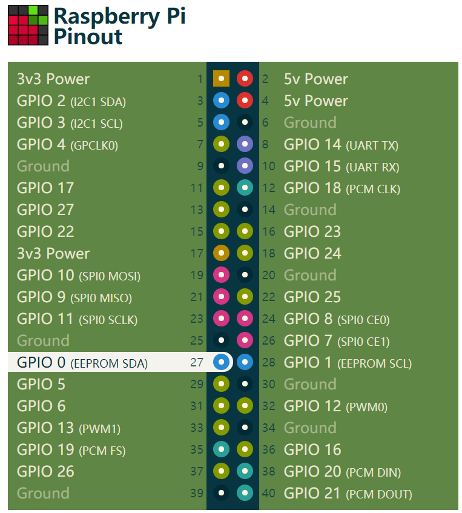
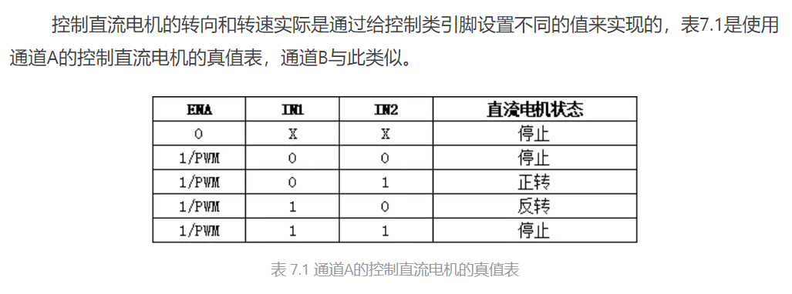
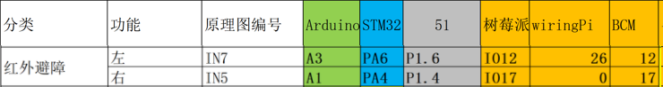
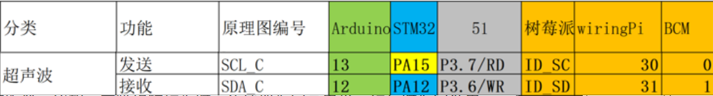

# 树莓派Scratch-to-Python

## 项目目标

### 项目流程

- 制作树莓派镜像。（开发环境）
- led电灯程序。（变量，常量，表达式，赋值）
- 电机和小车控制。（函数）
- 小车走迷宫。（分支，循环）
- 小车自动避障。（判断）
- 巡线小车。（最终目标）

### 项目要求

- 使用scratch和python对比编程。

## 第一部分 树莓派入门


## 第二部分 led点灯程序

### 查询Raspberry Pi的引脚图

[WiringPi at Raspberry Pi GPIO Pinout](https://pinout.xyz/pinout/wiringpi)



我们使用的引脚是`GPIO2 GPIO3`，其中 `GPIO2`接LED灯，`GPIO3`接按键。我们使用了一个和**回调函数**监控按键的发生，当回调的条件满足时，触发回调函数，执行回调函数内的代码。

## 第三部分 电机驱动

### 电机驱动原理

[第7章 用树莓派控制直流电机(L298N) - 简书 (jianshu.com)](https://www.jianshu.com/p/b970403a647f)

​		电机有专门的芯片控制，我们不需要去了解芯片的内在构造，只需要了解如何使用这种芯片。电机的输出端一般时接好的。电机的输入段一共有六个（`ENA, ENB, IN1, IN2, IN3, IN4`），每三个控制一个电机（或者说同边的电机）。下表是其中一组电机控制的真值表，另一组为（`ENB, IN3, IN4`）。同过下表，可知。



控制电机主要包含两部分：**转向**和**转速**。

#### 转向

`IN1 IN2`（或者`IN3 IN4`）用于控制电机的转向（正转/反转）。我们需要前进或者后退时，只需要将`IN1 IN2`其中一个设置为高电平。（具体哪一个是前进要结合电机的安装方式，正转不一定是前进）。需要停止时，只需要将`IN1 IN2`同时设置为低电平。

#### 转速

`ENA`（或者`ENB`）用于控制电机的转速，相当于控制小车速度。当其设置为1时，电机全速旋转。一般来说，我们不会让电机全速（转速太快），所以我们通过**PWM**调节电机的速度。PWM的原理不必深究，我们只需要知道怎么通过PWM控制转速。PWM有两个重要参数，频率和占空比。频率这里我们使用默认值2000（频率大小不影响电机速度），而占空比（1~100）和电机速度成正比，我们只需要调节占空比就可以实现对电机速度的控制。

## 第四部分 避障小车

[(4条消息) 超声波测距_liudongdong_jlu-CSDN博客_超声波测距](https://blog.csdn.net/liudongdong19/article/details/81005930) 

### 超声波测距原理

​		通过声波的反射的时间，计算发射点到障碍物的距离。可以计算出较为精确的距离。

### 红外测距原理

​		通过红外线遇到物体反射的时间，计算发射点到障碍物的距离远近，这个只能判断距离远近，不能测量具体的距离。比如，在障碍物较近时，传感器返回低电平，较远时返回高电平。通过高低电平可以判断物体的远近。可以通过调节旋钮控制传感器的灵敏度，即对远近的感知强弱。

### 小车避障原理

​		利用红外线传感器或者超声波传感器**实时**测量小车左侧和右侧到障碍物的距离。（对于超声波可以认为设定特定的距离作为阈值。比如30cm。对于红外传感器，可以调节旋钮设定合适的阈值。）

​		如果左边靠近障碍物，则小车需要向右转；如果右边靠近障碍物，可以向左转。如果两边同时靠近障碍物，可以选择向右转或者向左转。

### 实践指南

#### 红外避障和超声波引脚说明



**说明：**当遇到障碍物时，引脚为低电平；无障碍物时为高电平。我们使用的时**BCM**，所以对应引脚为`12, 17`



**说明：**超声波通过特定的信号协议传输距离信号。具体的原理如下。

#### 超声波测距实践说明（补充内容，了解）

- 超声波一共有四个引脚，`VCC` `GND` `Trig` `Echo` 其中 `VCC`为电源正极，`GND`为电源负极。

- 超声波测距步骤：

  - 告诉传感器我要测距：在`Trig`引脚向传感器发送一个大于10us的高电平脉冲。

    ```python
    # 第一步 发射测距信号
    GPIO.output(trig, GPIO.LOW)
    delay_us(2)  # 延时2us
    GPIO.output(trig, GPIO.HIGH)
    delay_us(10)  # 延时10us
    GPIO.output(trig, GPIO.LOW)
    ```

  - 传感器告诉我测量结果：传感器会在`Echo`端回应一个高电平脉冲，脉冲的时间对应声波往返的时间。

    ```python
    # 第二步 接收脉冲信号
    start_time = time()  # 记录低电平结束时间
    stop_time = time()  # 记录高电平结束时间
    while GPIO.input(echo) == GPIO.LOW:
    start_time = time()
    while GPIO.input(echo) == GPIO.HIGH:
    end_time = time()
    pulse_time = end_time - start_time  # 脉冲时间
    ```

  - 根据往返时间计算障碍物的距离：检测`Echo`高电平时间，对应声波往返时间，通过公式`(往返时间 * 34300(声速34300cm/s)) / 2 (单位：cm)`计算出障碍物到小车的距离。

    ```python
    # 第三步 计算测量距离
    # 公式：(pulse_time * 34300(声速34300cm/s)) / 2 (往返) (单位：cm)
    distance = (pulse_time * 34300) / 2
    ```

#### 避障逻辑

**首先说明：** 这里使用红外传感器作为避障的主演传感器。超声波同样可以，但是相对麻烦，同学们可以自己尝试。

**核心逻辑如下：**

- 当没有障碍物时，小车直行。

- 当左边遇到障碍物时，小车应该向右转。
- 当右边遇到障碍物时，小车应该向左转。
- 当两边同时遇到障碍物时，小车可以选择左转或右转。也可以先后退在左转或右转。（以上任意一种，取决于实际情况）

我们需要不断的去判断时是否存在障碍物，所以我们用一个`while`循环不断地判断上述条件是否满足。

```python
while True:
    leftState = GPIO.input(leftSensor)  # 获取左侧传感器的状态
    rightState = GPIO.input(rightSensor)  # 获取右侧传感器的状态

    # 逻辑分支 if elif(else if的合体) else
    if leftState == GPIO.HIGH and rightState == GPIO.HIGH:
        # 没有障碍物 前进
        motor.forward()
    elif leftState == GPIO.LOW and rightState == GPIO.HIGH:
        # 左侧有障碍物 右转
        motor.right()
    elif leftState == GPIO.HIGH and rightState == GPIO.LOW:
        # 右侧有障碍物 左转
        motor.left()
    else:
        # 两侧都有障碍物 先后退再右转
        motor.backward(1)
        motor.right()
```

 

